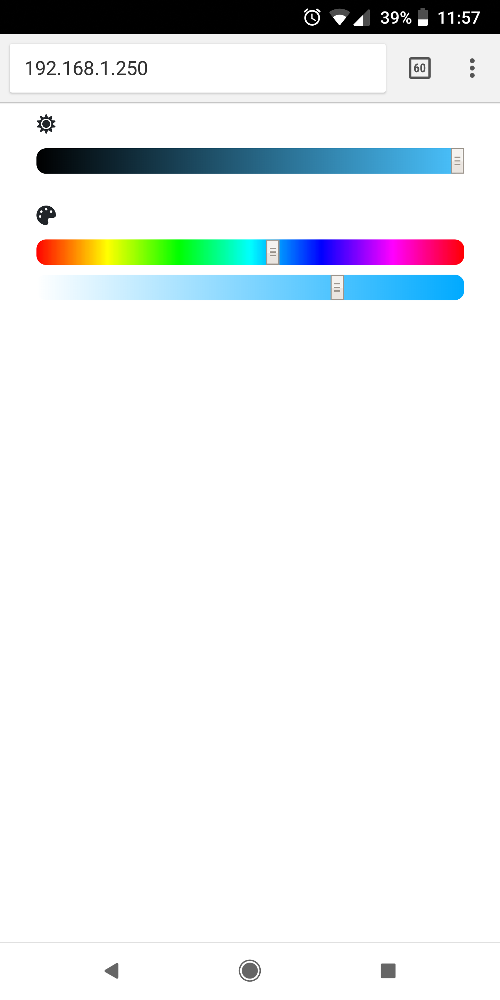

# 7-segment-clock

# Introduction
This project was created for a 3D printable 7 segment clock. You can find more information on Thingiverse https://www.thingiverse.com/thing:2947883.

# Installation
1. Install the [Arduino IDE](https://www.arduino.cc/en/Main/Software) (tested with version 1.8.13)
1. Install the [CH340 driver](https://www.wemos.cc/en/latest/tutorials/d1/get_started_with_arduino_d1.html#requirements)
1. In the preferences dialog of the Arduino IDE, add http://arduino.esp8266.com/stable/package_esp8266com_index.json to the Additional Boards Manager URLs
1. Open Boards Manager (under Tools), search for and install the latest version of esp8266 (tested with version 2.7.1).
1. Install libraries using the Library Manager (Sketch > Include Library > Manage Libraries):
    - [WiFiManager](https://github.com/tzapu/WiFiManager) (tested with version 0.15.0)
    - [ArduinoJSON](https://arduinojson.org) (version 5.x, not 6.x!) (tested with version 5.13.5)
    - [FastLED](https://github.com/FastLED/FastLED) (tested with version 3.3.3)
    - [Time](https://playground.arduino.cc/code/time/) (tested with version 1.6.0)
1. Install the [Arduino ESP8266 filesystem uploader plugin](https://github.com/esp8266/arduino-esp8266fs-plugin) (requires restart of IDE) (tested with version 0.5.0)
1. Connect your D1 mini to the computer using a micro USB cable
1. Under Tools, select "LOLIN(WEMOS) D1 R2 & mini" as the board
1. Tools > Flash Size > 4M (FS:1MB OTA:~1019KB)
1. Tools > Port > (pick the one that corresponds to your USB com port)
1. Open [clock.ino](Arduino/clock.ino)
1. Sketch > Upload
1. Upload the sketch data files (the [data](Arduino/data) directory in the sketch folder) using Tools > ESP8266 Sketch Data Upload.
1. If you want to use the Serial Monitor (Tools > Serial Monitor) for troubleshooting, be sure to change the baud rate to 115200 to match the baud rate specified in the sketch code

# Initial Configuration
1. When the sketch runs for the first time, the D1 mini will try to connect to your wifi and fail (because it doesn't have any previously saved wifi credentials). This will cause it to start up an access point, which serves up a captive configuration portal (thanks to [WiFiManager](https://github.com/tzapu/WiFiManager).
1. You can connect to this access point to select and enter credentials for your network
1. You can also enter your [ipstack.com](https://ipstack.com/) API key and [Google Time Zone](https://developers.google.com/maps/documentation/timezone/get-api-key)/[Google Maps Javascript](https://developers.google.com/maps/documentation/javascript/get-api-key) API key on this screen
1. **OPTIONAL** If you would like to manually specify a [UTC offset](https://en.wikipedia.org/wiki/UTC_offset), edit [config.json](Arduino/data/config.json) and specify a value for the JSON property "tzOffset" in seconds. You would only need to do this if you wish to avoid setting up an ipstack key or Google Maps API key or are experiencing issues with either API. For example, to set your clock to [UTC−06:00](https://en.wikipedia.org/wiki/UTC%E2%88%9206:00), you would set "tzOffset" to -21600. You will need to upload the sketch data files again using Tools > ESP8266 Sketch Data Upload.
1. Save (the D1 mini will restart and connect to your wifi)

# Runtime Configuration
1. While connected to the same network as the D1 mini, open a browser and go to http://\<IP of D1 mini> (you can find the D1 mini's IP address using your router).

